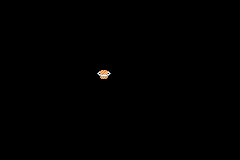

# orbits
An exercise for learning about header files in C++. See instructions [here](./instructions.md) 

When B is pressed Asteroids will start orbiting the planet on the screen, When A is pressed the asteroids will be removed 1 at a time. 

